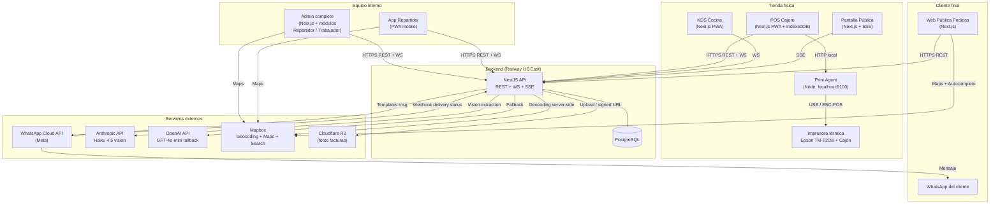

# POS Comida Rápida — Arquitectura v1

> Salida de Fase 3. Toma `pos-spec.v1.md` como insumo único. Documento ejecutable: si lo seguís, podés empezar a codear el lunes.

---

## 1. Diagrama de componentes



---

## 2. Estructura de monorepo

**Tooling:** Turborepo + pnpm workspaces + TypeScript strict + Prisma ORM.

```
pos-tercos/
├── apps/
│   ├── api/                  # NestJS backend (REST + WS + SSE)
│   ├── pos/                  # POS Cajero (Next.js PWA)
│   ├── kds/                  # KDS Cocina (Next.js PWA)
│   ├── public-display/       # Pantalla pública (Next.js, SSE)
│   ├── web/                  # Web pública pedidos (Next.js)
│   ├── admin/                # Admin + módulos repartidor / trabajador (Next.js)
│   └── print-agent/          # Servicio Node local impresora (instalado en PC mostrador)
├── packages/
│   ├── types/                # Tipos compartidos + schemas Zod (single source of truth)
│   ├── domain/               # Lógica de dominio compartida (motor de pricing, cálculo de receta, conversiones)
│   ├── ui/                   # Componentes UI compartidos (shadcn/ui base)
│   ├── config/               # eslint, prettier, tsconfig, tailwind base
│   └── api-client/           # Cliente tipado del API (generado de los DTOs Zod)
├── prisma/
│   ├── schema.prisma
│   └── migrations/
├── docker-compose.dev.yml    # Postgres local para dev
├── turbo.json
└── package.json
```

**Decisiones implícitas:**
- Prisma como ORM (mejor DX con TS, types autogenerados).
- Zod como single source of truth de validación: backend valida con Zod, types se infieren para frontend.
- shadcn/ui para componentes (radix + tailwind, sin lock-in).
- pnpm > npm/yarn (workspaces más rápidos, menos disco).
- Misma codebase de Next.js para POS/KDS pero con manifest.json + service worker propios para PWA.

---

## 3. Modelo de datos completo

### 3.1 Auth & Users

```sql
users (
  id              uuid PK
  email           text UNIQUE
  password_hash   text
  full_name       text
  phone           text
  role            enum('CAJERO','COCINERO','REPARTIDOR','ADMIN_OPERATIVO','DUENO','TRABAJADOR')
  must_change_pwd boolean default true
  active          boolean default true
  created_at      timestamptz
  
  -- Repartidor-only:
  availability    enum('DISPONIBLE','OCUPADO','OFFLINE') NULL
  last_active_at  timestamptz NULL
)

INDEX users (role, active)
INDEX users (email)
```

JWT auth: access token (15 min, en memoria) + refresh token (7 días, httpOnly cookie). Endpoint `/auth/refresh`.

### 3.2 Catálogo

```sql
products (
  id                    uuid PK
  name                  text
  description           text
  base_price            numeric(12,2)
  category              text
  image_url             text NULL
  modifiers_enabled     boolean default false
  is_combo              boolean default false  -- combos = productos especiales
  combo_price           numeric(12,2) NULL     -- only if is_combo
  is_active             boolean default true
  created_at            timestamptz
)

product_sizes (
  id                 uuid PK
  product_id         uuid FK
  name               text   -- "Pequeña", "Mediana", "Grande"
  price_modifier     numeric(12,2)  -- delta sobre base_price
)

product_modifiers (
  id              uuid PK
  product_id      uuid FK
  name            text
  price_delta     numeric(12,2)
  recipe_delta    jsonb  -- { add: [{ ingredient_id, qty }], remove: [...] }
)

combo_components (
  id          uuid PK
  combo_id    uuid FK   -- el product que es combo
  product_id  uuid FK   -- el componente
  quantity    int
)

subproducts (
  id          uuid PK
  name        text
  yield       numeric(10,4)  -- 1 batch produces N units
  unit        text default 'unidad'
  is_active   boolean default true
)

ingredients (
  id                 uuid PK
  name               text
  unit_purchase      text          -- 'kg', 'lt', 'caja'
  unit_recipe        text          -- 'g', 'ml', 'unidad'
  conversion_factor  numeric(14,6) -- unit_purchase * factor = unit_recipe
  threshold_min      numeric(14,4) -- alerta cuando stock < este valor (en unit_recipe)
  is_active          boolean default true
)
```

### 3.3 Receta (árbol producto/subproducto/insumo)

```sql
recipe_edges (
  id                    uuid PK
  parent_product_id     uuid FK NULL  -- exactly one of parent_*
  parent_subproduct_id  uuid FK NULL
  child_ingredient_id   uuid FK NULL  -- exactly one of child_*
  child_subproduct_id   uuid FK NULL
  quantity_neta         numeric(14,4)  -- en unit_recipe del child
  merma_pct             numeric(5,4) default 0  -- 0.05 = 5%
  
  CHECK (parent_product_id IS NOT NULL AND parent_subproduct_id IS NULL
       OR parent_product_id IS NULL     AND parent_subproduct_id IS NOT NULL)
  CHECK (child_ingredient_id IS NOT NULL AND child_subproduct_id IS NULL
       OR child_ingredient_id IS NULL     AND child_subproduct_id IS NOT NULL)
)

INDEX recipe_edges (parent_product_id)
INDEX recipe_edges (parent_subproduct_id)
INDEX recipe_edges (child_ingredient_id)
INDEX recipe_edges (child_subproduct_id)
```

**Función crítica `expandRecipe(productId)`** en `packages/domain`:
- Recursivamente desciende por subproductos hasta llegar a ingredientes raíz.
- Aplica `quantity_neta / (1 - merma_pct)` en cada nivel.
- Aplica `yield` del subproducto para escalar abajo.
- Retorna `Map<ingredientId, totalNeededInRecipeUnit>`.
- **Detecta ciclos** (un subproducto que se referencia a sí mismo) y lanza error.

### 3.4 Promociones

```sql
promotions (
  id                  uuid PK
  name                text
  type                enum('PERCENT_OFF','BOGO','FIXED_OFF','COMBO_OFF') default 'PERCENT_OFF'  -- v1 solo PERCENT_OFF
  discount_pct        numeric(5,4)  -- 0.20 = 20%
  days_of_week_mask   int           -- bitmask, lunes=1, martes=2, miércoles=4, ... domingo=64
  time_start          time          -- '14:00'
  time_end            time          -- '17:00'
  active_from         date NULL
  active_to           date NULL
  is_active           boolean default true
  created_by          uuid FK users
  created_at          timestamptz
)

promotion_products (
  promotion_id  uuid FK
  product_id    uuid FK
  PRIMARY KEY (promotion_id, product_id)
)
```

**Resolución overlap:** al cobrar, motor evalúa todas las promos activas que matchean día+hora+producto, elige la de mayor `discount_pct`. No acumulables.

### 3.5 Inventario

```sql
inventory_movements (
  id              uuid PK
  ingredient_id   uuid FK
  delta           numeric(14,4)  -- en unit_recipe (positivo=entrada, negativo=salida)
  type            enum('PURCHASE','SALE','MANUAL_ADJUSTMENT','WASTE','INITIAL')
  source_type     enum('invoice','sale','adjustment','manual') NULL
  source_id       uuid NULL
  user_id         uuid FK NULL
  notes           text NULL
  created_at      timestamptz default now()
  idempotency_key text UNIQUE NULL  -- para sync offline desde POS
)

INDEX inventory_movements (ingredient_id, created_at DESC)
```

Stock actual = `SELECT SUM(delta) FROM inventory_movements WHERE ingredient_id = ?`.

**Vista materializada `current_stock`** (refresh cada 30s o por trigger) para no recalcular en cada lectura del dashboard.

### 3.6 Proveedores y Facturas

```sql
suppliers (
  id          uuid PK
  nit         text UNIQUE
  name        text
  phone       text NULL  -- para WhatsApp (F-B)
  email       text NULL
  notes       text NULL
  is_active   boolean default true
  created_at  timestamptz
)

supplier_products (
  id                 uuid PK
  supplier_id        uuid FK
  ingredient_id      uuid FK
  last_unit_price    numeric(12,2)
  last_purchase_date date
  
  UNIQUE (supplier_id, ingredient_id)
)

invoices (
  id                  uuid PK
  supplier_id         uuid FK NULL  -- null hasta ser confirmada con un proveedor
  invoice_number      text          -- número del proveedor
  total               numeric(14,2)
  iva                 numeric(14,2)
  photo_url           text          -- R2 URL
  ai_extraction_json  jsonb         -- raw output del LLM
  status              enum('PENDING_REVIEW','CONFIRMED','REJECTED')
  confirmed_by        uuid FK users NULL
  confirmed_at        timestamptz NULL
  created_at          timestamptz
)

invoice_items (
  id              uuid PK
  invoice_id      uuid FK
  ingredient_id   uuid FK NULL  -- null si la IA no pudo matchear, requires manual
  description_raw text          -- lo que dice la factura
  quantity        numeric(14,4)
  unit            text          -- la unidad como dice la factura
  unit_price      numeric(14,2)
  total           numeric(14,2)
)
```

Al confirmar factura: por cada `invoice_item` con `ingredient_id`, se inserta un `inventory_movement` con `type=PURCHASE`, `delta = +quantity * conversion_factor` (si el item viene en unit_purchase) o `+quantity` (si ya viene en unit_recipe).

### 3.7 Ventas

```sql
sales (
  id                    uuid PK
  receipt_number        bigint UNIQUE  -- consecutivo continuo
  type                  enum('COUNTER','WEB_PICKUP','WEB_DELIVERY')
  status                enum(
                          'PENDIENTE_PAGO','PAGADO','EN_PREPARACION','LISTO_DESPACHO',
                          'ASIGNADO','EN_RUTA','ENTREGADO',
                          'CANCELADO_NO_PAGO','CANCELADO_SIN_REEMBOLSO',
                          'INTENTO_FALLIDO','DEVUELTO','EN_DISPUTA','VOID'
                        )
  turn_number           int        -- número de turno del día
  customer_name         text NULL
  customer_phone        text NULL
  customer_nit          text NULL
  delivery_address      text NULL
  delivery_lat          numeric(10,7) NULL
  delivery_lng          numeric(10,7) NULL
  subtotal              numeric(14,2)
  discount_total        numeric(14,2) default 0
  total                 numeric(14,2)
  payment_method        enum('CASH','NEQUI','DAVIPLATA','QR_BANCOLOMBIA','TRANSFER') NULL
  paid_at               timestamptz NULL
  paid_by_user_id       uuid FK users NULL  -- quien confirmó pago
  cashier_id            uuid FK users NULL
  shift_id              uuid FK shifts NULL
  
  -- delivery
  repartidor_id         uuid FK users NULL
  assigned_at           timestamptz NULL
  picked_up_at          timestamptz NULL
  departed_at           timestamptz NULL
  delivered_at          timestamptz NULL
  failed_attempts       int default 0
  
  notes                 text NULL
  idempotency_key       text UNIQUE NULL  -- para POS offline
  created_at            timestamptz default now()
)

INDEX sales (status, created_at DESC)
INDEX sales (cashier_id, created_at DESC)
INDEX sales (repartidor_id, status)
INDEX sales (type, status, created_at DESC)

sale_items (
  id                   uuid PK
  sale_id              uuid FK
  product_id           uuid FK
  size_id              uuid FK NULL
  quantity             int
  unit_price           numeric(12,2)  -- congelado al momento de venta
  modifiers_json       jsonb          -- snapshot de modifiers aplicados
  applied_promotion_id uuid FK NULL
  line_subtotal        numeric(14,2)
  line_discount        numeric(14,2) default 0
  line_total           numeric(14,2)
)

sale_status_log (
  id          uuid PK
  sale_id     uuid FK
  status_from text NULL
  status_to   text
  user_id     uuid FK NULL
  notes       text NULL
  changed_at  timestamptz default now()
)

INDEX sale_status_log (sale_id, changed_at)
```

**Receipt numbering:** secuencia Postgres `receipt_seq`, monotónica. Detección de saltos: cron diario que valida `MAX(receipt_number) - MIN(receipt_number) + 1 == COUNT(*)`. Si hay salto, alerta al Dueño.

### 3.8 Cierre de caja

```sql
shifts (
  id                uuid PK
  cashier_id        uuid FK users
  opened_at         timestamptz
  closed_at         timestamptz NULL
  opening_cash      numeric(14,2)
  expected_cash     numeric(14,2) NULL  -- calculado al cerrar
  counted_cash      numeric(14,2) NULL
  difference        numeric(14,2) NULL  -- counted - expected
  notes             text NULL
  status            enum('OPEN','CLOSED','RECONCILED')
)
```

Al cerrar:
- `expected_cash = opening_cash + SUM(sales WHERE payment_method='CASH' AND shift_id=this) - SUM(refunds CASH)`.
- `difference = counted_cash - expected_cash`.
- Si `|difference| > umbral_configurable` (ej. $5000 COP) → WhatsApp al Dueño.

### 3.9 Audit log y anti-fraude

```sql
audit_log (
  id           uuid PK
  user_id      uuid FK users
  action       text  -- 'sale.void', 'discount.apply', 'inventory.adjust', 'cash_drawer.open_no_sale', etc.
  entity_type  text
  entity_id    uuid NULL
  before_json  jsonb NULL
  after_json   jsonb NULL
  metadata     jsonb NULL  -- contexto extra (ej. amount, reason)
  created_at   timestamptz default now()
)

INDEX audit_log (user_id, created_at DESC)
INDEX audit_log (action, created_at DESC)

payment_reconciliations (
  id            uuid PK
  imported_by   uuid FK users
  period_from   date
  period_to     date
  source        enum('NEQUI_CSV','BANCOLOMBIA_CSV')
  raw_data      jsonb
  matches       jsonb  -- [{sale_id, status: 'OK'|'MISMATCH'|'MISSING'}]
  created_at    timestamptz
)
```

Audit log es **insert-only** (no UPDATE, no DELETE — enforced by Postgres permission).

### 3.10 Trabajadores (RRHH ligero)

```sql
workers (
  id                uuid PK
  user_id           uuid FK users  -- 1:1 con users.role='TRABAJADOR'
  full_name         text
  document          text
  position          text  -- 'Cajero', 'Cocinero', 'Repartidor', etc.
  payment_type      enum('PER_DAY','MONTHLY')
  payment_amount    numeric(14,2)
  active            boolean default true
  created_at        timestamptz
)

attendance (
  id          uuid PK
  worker_id   uuid FK
  check_in    timestamptz
  check_out   timestamptz NULL
  date        date
  notes       text NULL
)

payrolls (
  id            uuid PK
  worker_id     uuid FK
  period_from   date
  period_to     date
  total_amount  numeric(14,2)
  status        enum('DRAFT','APPROVED','PAID')
  paid_at       timestamptz NULL
  created_by    uuid FK users
)
```

### 3.11 WhatsApp y notificaciones

```sql
whatsapp_messages (
  id                 uuid PK
  recipient_phone    text
  template_name      text NULL  -- null si es free-text post-respuesta del cliente
  payload            jsonb
  meta_message_id    text NULL
  status             enum('QUEUED','SENT','DELIVERED','READ','FAILED')
  error              text NULL
  related_entity     text NULL  -- 'sale', 'invoice_alert', 'cash_alert', etc.
  related_id         uuid NULL
  sent_at            timestamptz NULL
  created_at         timestamptz default now()
)

INDEX whatsapp_messages (status, created_at)
INDEX whatsapp_messages (related_entity, related_id)
```

### 3.12 Sugerencias de auto-pedido [F-B]

```sql
purchase_suggestions (
  id              uuid PK
  generated_at    timestamptz
  ai_model_used   text  -- 'claude-haiku-4-5' / 'gpt-4o-mini'
  triggered_by    enum('AUTO_THRESHOLD','MANUAL')
  payload         jsonb  -- { groups: [{ supplier_id, items: [...], whatsapp_text }] }
  status          enum('PENDING','APPROVED','REJECTED','SENT')
  approved_by     uuid FK users NULL
  approved_at     timestamptz NULL
  whatsapp_msg_id uuid FK whatsapp_messages NULL
)
```

Trigger: cron cada hora evalúa insumos bajo `threshold_min`. Si hay alguno → IA genera sugerencia → `purchase_suggestions` queda en `PENDING` → notif al Admin Operativo y Dueño. Tap aprobar → fanout WhatsApp al proveedor.

---

## 4. Superficie de API

REST con NestJS, validación con Zod (vía `nestjs-zod`). Realtime en endpoints separados (WS / SSE).

### 4.1 Convenciones

- Auth: `Authorization: Bearer <jwt>`.
- Formato: JSON, `application/json`.
- Errores: `{ statusCode, message, code, details? }` consistentes.
- Idempotency: `Idempotency-Key` header en POSTs críticos (ventas, movimientos, confirmaciones).
- Pagination: `?page=1&limit=20` con `X-Total-Count` header.

### 4.2 Endpoints por dominio

#### Auth
```
POST   /auth/login                 { email, password } → { access, refresh, user }
POST   /auth/refresh               { refresh } → { access }
POST   /auth/logout                
POST   /auth/change-password       { old, new }
GET    /auth/me                    → user
```

#### Productos / Recetas
```
GET    /products                   ?category=&active=
GET    /products/:id
POST   /products                   [admin/dueño]
PATCH  /products/:id               [admin/dueño]
DELETE /products/:id               [admin/dueño]

GET    /products/:id/recipe        → tree
PUT    /products/:id/recipe        → set complete recipe

GET    /subproducts                
POST   /subproducts                
PATCH  /subproducts/:id            
GET    /subproducts/:id/recipe
PUT    /subproducts/:id/recipe

GET    /products/:id/expanded-cost → COGS recursivo (usa `expandRecipe`)
```

#### Inventario / Insumos
```
GET    /ingredients                ?low_stock=true
GET    /ingredients/:id            (incluye stock actual)
POST   /ingredients                [admin]
PATCH  /ingredients/:id            
POST   /inventory/adjustments      [admin operativo / dueño] { ingredient_id, delta, reason }
GET    /inventory/movements        ?ingredient_id=&from=&to=
```

#### Proveedores / Facturas
```
GET    /suppliers
POST   /suppliers                  
GET    /suppliers/:id              (con productos típicos)
GET    /suppliers/:id/invoices

POST   /invoices/upload-photo      multipart → { invoice_id_draft, ai_extraction }
POST   /invoices/from-clone        { supplier_id } → { invoice_id_draft, prefilled_items }  (manual rápido)
POST   /invoices/:id/confirm       [admin operativo / dueño] { items[] } → impacta inventario
GET    /invoices                   ?supplier_id=&status=
```

#### Ventas POS (mostrador)
```
POST   /sales                      [cajero] { items, payment_method, customer_nit? }
                                   header Idempotency-Key
                                   → { sale_id, receipt_number, ... }
POST   /sales/:id/confirm-payment  [cajero] { method, amount }
POST   /sales/:id/void             [admin operativo / dueño] { reason } (requires approval)
POST   /sales/:id/print            (re-print)
```

#### Pedidos web
```
POST   /web/orders                 (público) { items, customer, type, address?, lat?, lng? }
                                   → { order_id, payment_instructions, eta }
GET    /web/orders/:id             ?token= (público con token de orden)
POST   /web/orders/:id/confirm-payment  [cajero / admin]
```

#### KDS
```
GET    /kds/orders                 [cocinero] (PAID + EN_PREPARACION)
POST   /kds/orders/:id/start       (status PAID → EN_PREPARACION)
POST   /kds/orders/:id/ready       (status EN_PREPARACION → LISTO_DESPACHO)
WS     /ws/kds                     subscribe to kitchen.queue
```

#### Repartidor
```
GET    /repartidor/orders          [repartidor] (sus asignados, ordered Haversine)
POST   /repartidor/orders/:id/depart      (ASIGNADO → EN_RUTA)
POST   /repartidor/orders/:id/deliver     (EN_RUTA → ENTREGADO)
POST   /repartidor/orders/:id/failed      (EN_RUTA → INTENTO_FALLIDO_N)
POST   /repartidor/orders/:id/return      (* → DEVUELTO)
PUT    /repartidor/availability    { status: 'DISPONIBLE'|'OCUPADO'|'OFFLINE' }
WS     /ws/repartidor              subscribe to repartidor.assignments
```

Asignación: cuando una sale pasa a `LISTO_DESPACHO` y `type=WEB_DELIVERY`, un servicio busca repartidor `DISPONIBLE` con menor `last_assigned_at`, asigna, emite WS.

#### Pantalla pública
```
GET    /public-display/state       → { current_turn, next_turns[] }
GET    /public-display/stream      SSE: emite cada cambio de current_turn
```

#### Cierre de caja
```
POST   /shifts/open                [cajero] { opening_cash }
GET    /shifts/current             [cajero]
POST   /shifts/close               [cajero] { counted_cash, notes? }
                                   → { expected, difference, alert_sent }
GET    /shifts                     ?cashier_id=&from=&to=  [admin/dueño]
```

#### Reportes / Dashboard
```
GET    /reports/dashboard          [dueño] → top 8 hero
GET    /reports/sales              ?from=&to=&group_by=day|week|month
GET    /reports/cogs               ?product_id=
GET    /reports/anomalies          [dueño]
GET    /reports/inventory          (rotación, cobertura, merma)
GET    /reports/web-funnel
GET    /reports/payment-reconciliation
POST   /reports/payment-reconciliation/import multipart (CSV)
```

#### Promociones
```
GET    /promotions                 ?active_now=true
POST   /promotions                 [admin operativo / dueño]
PATCH  /promotions/:id
DELETE /promotions/:id
```

#### Auto-pedido [F-B]
```
GET    /purchase-suggestions       ?status=PENDING
POST   /purchase-suggestions/regenerate  [admin/dueño]
PATCH  /purchase-suggestions/:id   (editar antes de aprobar)
POST   /purchase-suggestions/:id/approve [admin/dueño]
                                   → genera WhatsApp(s) al/los proveedor(es)
POST   /purchase-suggestions/:id/reject  [admin/dueño]
```

#### Trabajadores (RRHH)
```
GET    /workers                    [admin/dueño]
POST   /workers                    [admin/dueño]
GET    /workers/me                 [trabajador]
POST   /workers/me/check-in        [trabajador]
POST   /workers/me/check-out       [trabajador]
GET    /workers/me/payroll         [trabajador]
POST   /workers/:id/payrolls       [admin/dueño] (genera período)
PATCH  /workers/:id/payrolls/:pid  status PAID
```

#### Audit log
```
GET    /audit                      [dueño] ?from=&to=&user_id=&action=
```

#### WhatsApp webhooks
```
POST   /webhooks/whatsapp          (Meta callback: delivery, read, replies)
GET    /webhooks/whatsapp          (Meta verification challenge)
```

### 4.3 Realtime

| Canal | Protocolo | Eventos |
|---|---|---|
| `/ws/kds` | WebSocket | `order.created`, `order.status.changed` |
| `/ws/pos` | WebSocket | `web-order.pending-payment`, `cashier.alert` |
| `/ws/repartidor` | WebSocket | `assignment.new`, `assignment.cancelled` |
| `/public-display/stream` | SSE | `turn.updated` |
| `/ws/admin` | WebSocket | `purchase-suggestion.new`, `cash.discrepancy`, `inventory.alert` |

WS implementado con `@nestjs/websockets` + `socket.io`. Auth por JWT en handshake.

---

## 5. Estrategia offline (POS y KDS)

### 5.1 Qué se cachea local

PWA + `IndexedDB` con stores:
- `catalog_snapshot`: productos, subproductos, insumos, recetas, modificadores, combos. Incluye hash. Se refresca al iniciar sesión y cada 30 min mientras hay conexión.
- `promotions_snapshot`: promociones activas + agenda futura (próximas 7 días).
- `pending_operations`: cola FIFO de operaciones offline.
- `recent_sales`: últimas 50 ventas para mostrar histórico.
- `current_shift`: turno abierto.

Service worker estrategia:
- API `GET` reads → `network-first, fallback cache`.
- API `POST/PATCH/DELETE` → `network-only`. Si falla, encola en `pending_operations`.
- Static assets → `cache-first`.

### 5.2 Cola de sync

Schema `pending_operations`:
```typescript
{
  id: string,           // UUID local
  idempotency_key: string,
  endpoint: string,
  method: 'POST' | 'PATCH' | 'DELETE',
  payload: object,
  created_at: Date,
  retry_count: number,
  last_error?: string,
}
```

Worker: cada vez que hay conexión, drena la cola en orden FIFO. Si una request falla por error 5xx, retry con backoff exponencial (1s, 5s, 30s, 2min). Si falla 4xx (validación), marca error y notifica al usuario.

**Idempotency en backend:** todas las rutas que aceptan `Idempotency-Key` chequean en una tabla `idempotency_keys` (ttl 7 días) si ya procesaron esa key. Si sí → retornan respuesta cacheada. No duplican operaciones.

### 5.3 Operaciones permitidas offline

| Operación | Offline OK | Razón |
|---|---|---|
| Abrir turno | ❌ | Necesita verificar que no hay otro turno abierto. |
| Crear venta mostrador | ✅ | idempotency_key garantiza unicidad. |
| Cobrar (efectivo o digital) | ✅ | Se confirma localmente, sync después. **Excepción:** confirmación de pago digital web requiere conexión (no podés validar app del banco offline). |
| Imprimir recibo | ✅ | El agente local se conecta a la impresora directamente, no necesita API. |
| Abrir cajón | ✅ | Comando ESC/POS, sin API. |
| Cambiar estado en KDS | ✅ | Idempotente con `idempotency_key`. |
| Crear/editar producto | ❌ | Bloqueado en UI cuando offline. |
| Cierre de turno | ❌ | Necesita drenar cola pendiente y calcular esperado contra DB. UI fuerza sync antes. |
| Cargar factura | ❌ | Necesita IA, sí o sí online. |

### 5.4 Conflicts y reconciliación

- **Ventas creadas offline mientras producto fue editado online:** el `unit_price` está congelado en `sale_items` desde la creación local. Se sube tal cual. No hay conflicto.
- **Stock derivado:** los `inventory_movements` derivados de ventas se calculan **en backend** al recibir la venta, no en cliente. Imposible que el cliente cause stock negativo "imposible".
- **Stock negativo aceptable:** si una venta deja un insumo en negativo, se permite (puede haber stock real que no se contabilizó por inventario inicial mal cargado), se loguea warning y se alerta al admin.
- **Cierre de turno con cola pendiente:** UI bloquea el botón de cierre hasta `pending_operations.length === 0`. Mensaje: "Subiendo X ventas pendientes...".

---

## 6. Tiempo real

### 6.1 KDS (WebSocket)

Cuando una sale entra a `PAGADO` (sea de mostrador o web), backend emite a room `kitchen.queue`:
```typescript
{ event: 'order.created', sale }
```
KDS suscrito al room recibe en vivo. Cuando cocinero marca `EN_PREPARACION` o `LISTO_DESPACHO`, backend emite `order.status.changed`.

### 6.2 Pantalla pública (SSE)

Endpoint `/public-display/stream` mantiene conexión SSE abierta. Backend emite cuando:
- Una sale `LISTO_DESPACHO` cambia a "atendido en mostrador" (cliente recoge) → next turn.
- Cocinero marca un nuevo turno como listo.

Estado en pantalla:
```typescript
{
  current_turn: number,         // turno en este momento
  next_turns: number[]          // próximos 1-2 listos
}
```

Reconnect automático del browser (`EventSource`) si se cae conexión. Si TV/tablet pierde red, sigue mostrando el último estado hasta reconectar.

### 6.3 Repartidor (WebSocket)

Repartidor abre WS al iniciar app. Backend emite a su user_id room:
- `assignment.new` cuando le asignan pedido (round-robin lo eligió).
- `assignment.cancelled` si el cliente cancela mientras está asignado.

### 6.4 POS Cajero (WebSocket)

Cajero recibe:
- `web-order.pending-payment` cuando entra un pedido web nuevo (suena alerta sonora).
- `cashier.alert` para casos como "tu request de aprobación fue aceptada/rechazada".

### 6.5 Admin (WebSocket)

Admin operativo y Dueño suscritos a:
- `purchase-suggestion.new` cuando IA generó nueva sugerencia de auto-pedido.
- `cash.discrepancy` cuando un cierre tiene descuadre.
- `inventory.alert` cuando un insumo cae bajo umbral.

---

## 7. Autenticación, roles y permisos

### 7.1 Auth

- JWT HS256, secret en env var de Railway.
- Access token: 15 min, en memoria de la app frontend.
- Refresh token: 7 días, httpOnly + Secure + SameSite=Lax cookie.
- Endpoint `/auth/refresh` rota access. Refresh rotation opcional en v2.
- Logout: invalida refresh en server-side blacklist (Redis o columna en DB con expiry).

### 7.2 Guards (NestJS)

```typescript
@Roles('DUENO')
@UseGuards(JwtAuthGuard, RolesGuard)
```

Decoradores compuestos por rol:
- `@OnlyDueno()` → DUENO
- `@AdminAccess()` → ADMIN_OPERATIVO | DUENO
- `@CashierAccess()` → CAJERO | ADMIN_OPERATIVO | DUENO
- `@InternalAccess()` → cualquier rol interno (no público).

### 7.3 Aprobaciones inline (cajero)

Cuando cajero intenta una acción que requiere aprobación (ej. anular venta, descuento >15%):
1. POS llama endpoint con header `X-Approval-Pin: <pin>`.
2. Backend valida PIN del Admin Operativo o Dueño contra tabla de pines de aprobación.
3. Si OK: ejecuta la acción + audit log con `approved_by_user_id`.
4. Si NO: 403 + log de intento fallido.

Pines de aprobación: cada Admin/Dueño tiene un PIN de 6 dígitos (separado de su password) que se ingresa en el POS sin abrir sesión nueva. Tabla `approval_pins` con hash.

### 7.4 Endpoints públicos (sin auth)

- `/web/orders` POST (crear pedido).
- `/web/orders/:id` GET con token (status check).
- `/auth/login`.
- `/webhooks/whatsapp`.
- `/healthz`.

Rate-limit: 100 req/min por IP en endpoints públicos (NestJS Throttler).

---

## 8. Integraciones externas (resumen — detalle en Fase 4)

| Servicio | Uso | Adapter |
|---|---|---|
| WhatsApp Cloud API (Meta) | Notificaciones tx | `WhatsAppProvider` interface, impl `MetaWhatsAppAdapter` |
| Anthropic Claude Haiku 4.5 | Extracción factura, sugerencias auto-pedido | `LLMProvider`, impl `AnthropicAdapter` |
| OpenAI GPT-4o-mini | Fallback IA | `LLMProvider`, impl `OpenAIAdapter` |
| Mapbox | Geocoding + Autocomplete + Maps | Cliente (frontend) usa SDK directo. Backend usa Geocoding API para validación 3km. |
| Cloudflare R2 | Storage fotos facturas | S3 SDK con endpoint R2 |
| Bancolombia / Nequi | v1: solo confirmación visual + import CSV | `PaymentProvider` interface (stub en v1) |
| DIAN | v2 | `BillingProvider` interface (stub en v1) |
| Rappi | v2 | `DeliveryAggregatorProvider` interface (stub en v1) |

**Adapter pattern obligatorio** para WhatsApp, IA, pagos, billing, delivery aggregator. Todos detrás de interfaces tipadas en `packages/types`. Permite swap a v2 sin tocar dominio.

---

## 9. Despliegue

### 9.1 Topología

| Recurso | Proveedor | Plan | Costo USD/mes |
|---|---|---|---|
| Frontends (5 apps Next.js) | Vercel | Pro | $20 |
| Backend NestJS | Railway | Service medium | $10-20 |
| PostgreSQL | Railway | Postgres medium | $10-20 |
| Storage facturas | Cloudflare R2 | Pay-as-you-go | <$1 |
| Print Agent | Self-hosted en PC mostrador | — | $0 |
| WhatsApp Cloud API | Meta | Pay-per-conversation | $25-45 |
| Anthropic API | Pay-as-you-go | Cap $20 | <$10 |
| Mapbox | Free tier | — | $0 |
| Domain + SSL | Cualquier registrar (Cloudflare) | — | $1-2 |
| **TOTAL estimado** | | | **$67-118** |

### 9.2 Environments

- **local:** Postgres en Docker compose, frontends en dev mode, WhatsApp sandbox/Twilio dev.
- **staging:** Railway env staging + Vercel preview branches. WhatsApp con número de prueba. IA con tokens reducidos.
- **production:** Railway main + Vercel main branch.

### 9.3 CI/CD (GitHub Actions)

- Push a `main` → deploy automático a Vercel + Railway.
- Push a feature branches → preview Vercel.
- Pre-deploy: lint + typecheck + tests (jest unit + supertest e2e backend) + Prisma migrate deploy.
- Manual approval gate antes de Railway production deploy (proteger DB de migraciones rotas).

### 9.4 Configuración del PC de mostrador

- Windows o Ubuntu.
- Auto-arranque del navegador apuntando a `https://pos.tudominio.co`.
- Auto-arranque del Print Agent (servicio Windows / systemd).
- VPN opcional para acceso remoto (Tailscale gratis para 1 device).
- Backup local: el navegador guarda IndexedDB → no perdés ventas si crashea.

### 9.5 Configuración tablet pantalla pública

- Tablet Android con kiosk app (ej. Fully Kiosk Browser).
- URL: `https://display.tudominio.co`.
- Auto-encendido al conectar a corriente (donde el hardware lo soporte).
- Sin user input, sin gestures, full screen.

---

## 10. Backups y recuperación

| Activo | Frecuencia | Retención | Restore RTO |
|---|---|---|---|
| Postgres | Diario automático (Railway) | 7 días | <1h |
| Fotos facturas (R2) | Inmutable, immediate | Indefinido | Inmediato |
| Audit log (DB) | Sigue al backup de Postgres | 7 días + export trimestral a R2 | <1h |
| Código | Git en GitHub | Indefinido | <30 min |

**Restore drill recomendado:** una vez antes de go-live, hacer `pg_restore` en una DB temporal y verificar que todo funciona. Documentar pasos en `runbook.md`.

---

## 11. Riesgos técnicos top 5 con mitigación

| # | Riesgo | Probabilidad | Impacto | Mitigación |
|---|---|---|---|---|
| 1 | **Aprobación de Meta WABA tarda > 15 días** o niega plantillas | Alta | Bloquea WhatsApp en prod | Iniciar día 1; mientras se aprueba, dev en sandbox de Twilio (tiene WhatsApp dev gratis); plan B = Twilio en producción si Meta deniega; arquitectura ya tiene adapter `WhatsAppProvider`. |
| 2 | **Calidad de IA en facturas reales colombianas** (foto borrosa, escritura a mano, formatos varios) | Alta | Adopción de [F-C] floja → manual rápido se vuelve la vía dominante | Testing con 30+ facturas reales semana 4; prompt iterativo; fallback automático a OpenAI; manual rápido (clonar última factura) siempre disponible; UI de edición humana resuelve fallas residuales. |
| 3 | **Hardware ESC/POS — diversidad de modelos genera bugs raros** | Media | Print fail bloquea operación | Comprar Epson TM-T20III específicamente (más documentado en CO); usar `node-thermal-printer` (testeada); tener una impresora de backup; modo de fallback que muestra recibo en pantalla del POS si la impresora falla. |
| 4 | **Sync offline POS — race conditions en cola al volver online con muchas ventas pendientes** | Media | Posible duplicación o pérdida de venta | Idempotency keys obligatorias; retries con backoff; tests de stress de sync; UI bloquea cierre de turno hasta cola vacía; logs detallados de cada sync. |
| 5 | **Plazo realista vs scope creep durante dev** | Alta | v1 se atrasa más allá de 18 semanas | Feature freeze post-Fase-2; cualquier idea nueva va a `v1.x-backlog.md`; review semanal de avance contra plan; flag temprano de bloqueos a discutir. |

**Riesgo bonus #6 (regulatorio, no técnico):** **Validación DIAN con contador**. Si tu régimen tributario obliga a documento equivalente electrónico POS, hay que reescoper. Marcado en GAP-14, validar antes de semana 4.

---

## 12. Plan v1 detallado por sprints (14-18 semanas)

> Cada sprint = 1 semana calendario. Ajustá si tu velocidad real difiere.

### Sprint 0 — Setup e infra (semana 1)
- [ ] Crear monorepo Turborepo + pnpm workspaces.
- [ ] NestJS app + Prisma + Postgres dev en Docker.
- [ ] Setup Railway staging + Postgres managed.
- [ ] Auth (JWT + refresh + roles + guards).
- [ ] CI/CD GitHub Actions.
- [ ] Vercel preview deploys.
- [ ] **En paralelo, NO BLOQUEANTES:** comprar línea telefónica del negocio + iniciar Meta Business Verification + comprar impresora Epson TM-T20III + cajón + tablet + reunión con contador.

### Sprint 1 — Modelo central de productos y recetas (semana 2)
- [ ] Migrations: products, subproducts, ingredients, recipe_edges, sizes, modifiers, combo_components.
- [ ] Función `expandRecipe(productId)` con detección de ciclos.
- [ ] CRUD de products en Admin.
- [ ] CRUD de subproducts.
- [ ] CRUD de ingredients (con conversion_factor + threshold_min).

### Sprint 2 — UI de gestión de recetas + inventario base (semana 3)
- [ ] UI editor de receta con árbol expandible (drag-and-drop opcional).
- [ ] Ingestión de receta con validación (no ciclos, unidades coherentes).
- [ ] Migration: inventory_movements + idempotency_keys.
- [ ] CRUD de movimientos manuales.
- [ ] Vista materializada `current_stock` + refresh automático.
- [ ] Audit log infra (insert-only enforcement).

### Sprint 3 — Proveedores + IA facturas (semana 4)
- [ ] Migrations: suppliers, supplier_products, invoices, invoice_items.
- [ ] CRUD de proveedores con UI completa de productos por proveedor (decisión GAP-8 = C).
- [ ] Adapter `LLMProvider` con impl `AnthropicAdapter` y `OpenAIAdapter`.
- [ ] Endpoint `/invoices/upload-photo` → R2 + extracción IA.
- [ ] UI de revisión y edición de factura extraída.
- [ ] **Manual rápido:** endpoint `/invoices/from-clone` + UI Excel-like.
- [ ] Confirmación de factura → impacto en inventario.
- [ ] **Hito:** validar con 10 facturas reales del negocio.

### Sprint 4 — POS Cajero base (semana 5)
- [ ] UI POS con catálogo, carrito, modificadores, combos.
- [ ] Cobro efectivo + digital (sin doble validación todavía).
- [ ] Numeración de recibos consecutiva.
- [ ] Promociones engine: aplicar descuento mayor en overlap.
- [ ] Integración con expandRecipe para descuentos de inventario al confirmar venta.

### Sprint 5 — POS offline + Print Agent (semana 6)
- [ ] PWA setup (manifest, service worker).
- [ ] IndexedDB stores: catalog_snapshot, pending_operations, etc.
- [ ] Cola de sync con idempotency keys.
- [ ] Print Agent: Node service local, ESC/POS via `node-thermal-printer`.
- [ ] Comando apertura de cajón.
- [ ] Modo fallback: recibo en pantalla si impresora falla.
- [ ] Doble validación de pago digital (UI + flujo).

### Sprint 6 — KDS + Pantalla Pública (semana 7)
- [ ] UI KDS con tarjetas + estados + tap.
- [ ] WS gateway `/ws/kds`.
- [ ] Tiempos por etapa registrados (sale_status_log).
- [ ] Pantalla pública UI (turno grande centrado).
- [ ] SSE endpoint `/public-display/stream`.
- [ ] Modo kiosko probado en tablet real.

### Sprint 7 — Web Pública + Mapbox (semana 8)
- [ ] UI web pública: menú, carrito, checkout sin login.
- [ ] Mapbox Search Box para autocomplete.
- [ ] Mapbox map con círculo 3km en checkout.
- [ ] Validación 3km backend con Mapbox Geocoding.
- [ ] Estados PENDIENTE_PAGO + creación de orden web.
- [ ] Confirmación de pago desde POS por cajero.

### Sprint 8 — WhatsApp Cloud API (semana 9)
- [ ] Adapter `WhatsAppProvider` con impl `MetaWhatsAppAdapter`.
- [ ] Plantillas a aprobar en Meta (4 mínimo: payment_instructions, payment_received, order_in_preparation, order_dispatched, order_delivered, cash_discrepancy_alert).
- [ ] Webhook receiver para delivery status.
- [ ] Tabla whatsapp_messages + queue worker.
- [ ] Integración con flujo de pedido web (envíos automáticos en cada cambio de estado).

### Sprint 9 — Módulo Repartidor parte 1 (semana 10)
- [ ] App PWA mobile-first del repartidor.
- [ ] Auth login email/password con cambio de pwd inicial obligatorio.
- [ ] Toggle availability DISPONIBLE / OCUPADO / OFFLINE.
- [ ] Lista de pedidos asignados (por user_id).
- [ ] Round-robin assignation service en backend.
- [ ] WS `/ws/repartidor` para asignaciones nuevas.

### Sprint 10 — Módulo Repartidor parte 2 (semana 11)
- [ ] Mapa Mapbox con pines de pedidos asignados.
- [ ] Sort por Haversine desde dirección del restaurante.
- [ ] Estados ASIGNADO → EN_RUTA → ENTREGADO con botones grandes.
- [ ] Edge cases: INTENTO_FALLIDO_N (1, 2, max 3), DEVUELTO.
- [ ] Visibilidad celular cliente solo durante estado activo.
- [ ] Override manual desde POS/Admin.
- [ ] Cancelación post-pago = `CANCELADO_SIN_REEMBOLSO`, requires aprobación dueño.

### Sprint 11 — Cierre de caja + anti-fraude controles 1-3 (semana 12)
- [ ] Apertura/cierre de turno (shifts).
- [ ] Conteo + comparación + cálculo difference.
- [ ] Alerta WhatsApp al Dueño si descuadre.
- [ ] **Control 1:** audit log poblado + UI lectura para Dueño.
- [ ] **Control 2:** flujo de aprobación con PIN para acciones sensibles del cajero.
- [ ] **Control 3:** reporte de anomalías por cajero (2σ del histórico personal).

### Sprint 12 — Anti-fraude controles 4-5 + auto-pedido [F-B] (semana 13)
- [ ] **Control 4:** import CSV de extracto Nequi/Bancolombia + matching contra confirmaciones.
- [ ] **Control 5:** detección de saltos en consecutivo de recibos (cron diario).
- [ ] Tabla `purchase_suggestions` + cron que genera sugerencias.
- [ ] Adapter prompt para Claude Haiku 4.5 (con histórico de consumo + última factura).
- [ ] UI de sugerencias pendientes en Admin/Dueño.
- [ ] Aprobación con tap → fanout WhatsApp(s) al/los proveedor(es).

### Sprint 13 — Reportes y dashboard (semana 14)
- [ ] Endpoint `/reports/dashboard` con top 8.
- [ ] UI dashboard hero del Dueño.
- [ ] Sub-páginas: ventas detalle, COGS, inventario, web funnel, anti-fraude profundo, payment reconciliation.
- [ ] Export CSV de reportes.

### Sprint 14 — Web de Trabajadores (RRHH ligero) (semana 15)
- [ ] UI login para rol Trabajador.
- [ ] CRUD workers desde Admin.
- [ ] Asistencia (check-in/check-out).
- [ ] Generación de payrolls (período).
- [ ] Aprobación + marcado de pago.

### Sprint 15 — Polish UX cajero + PWA hardening (semana 16)
- [ ] Foco en [F-J]: revisar todo el flujo del cajero, eliminar fricción.
- [ ] Atajos de teclado en POS.
- [ ] Tests de stress de sync offline (cola con 50+ ventas).
- [ ] Error handling consistente.
- [ ] Internacionalización mínima (es-CO).

### Sprint 16 — QA con usuarios reales + bugfix (semana 17)
- [ ] Sesión de prueba con cajero real (1-2 días).
- [ ] Sesión de prueba con cocinero real.
- [ ] Sesión de prueba con repartidor real.
- [ ] Bugfix de issues encontrados.
- [ ] Validación legal con contador (DIAN GAP-14) — debería estar resuelta antes pero acá es el último checkpoint.
- [ ] Migración del catálogo real al sistema (productos, recetas, insumos, proveedores, primeras facturas).

### Sprint 17 — Soft launch y ajustes (semana 18)
- [ ] Deploy producción Vercel + Railway.
- [ ] Verificación de plantillas WhatsApp aprobadas y activas.
- [ ] Soft launch en tienda con uso real (3-4 días).
- [ ] Standby para bugs en producción.
- [ ] Ajustes finos en UX y umbrales.

### Sprint 18 — Buffer y go-live oficial (semana 19, opcional)
- [ ] Slack reservado para imprevistos.
- [ ] Documentación de runbook (cómo reiniciar Print Agent, cómo importar CSV de Nequi, etc.).
- [ ] Capacitación final del equipo.
- [ ] Go-live oficial.

---

## 13. v2 — qué queda diferido

Lista completa en `pos-spec.v1.md` sección 6. Resumen:

- DIAN facturación electrónica.
- Pasarela de pagos integrada + datáfono.
- Lector de barras.
- Rappi / Didi / Uber Eats (puerto/adapter ya listo).
- App nativa.
- Login / fidelización del cliente final.
- Multi-tienda / multi-tenant.
- Tracking GPS continuo + ETA dinámico al cliente.
- Optimización TSP real para repartidor multi-parada.
- Sort dinámico desde ubicación actual del repartidor.
- Promociones avanzadas (BOGO, FIXED_OFF, COMBO_OFF).
- Auto-importación del extracto bancario.
- Detección anómala anti-fraude por IA.
- IA narrativa (estados financieros, reportes operativos).
- IA en cierre de caja sugiriendo causas.
- RBAC granular.
- Alertas avanzadas de inventario (vencimientos, rotación, anomalía).

---

**FASE 3 COMPLETADA, ¿OK, sigue?**
